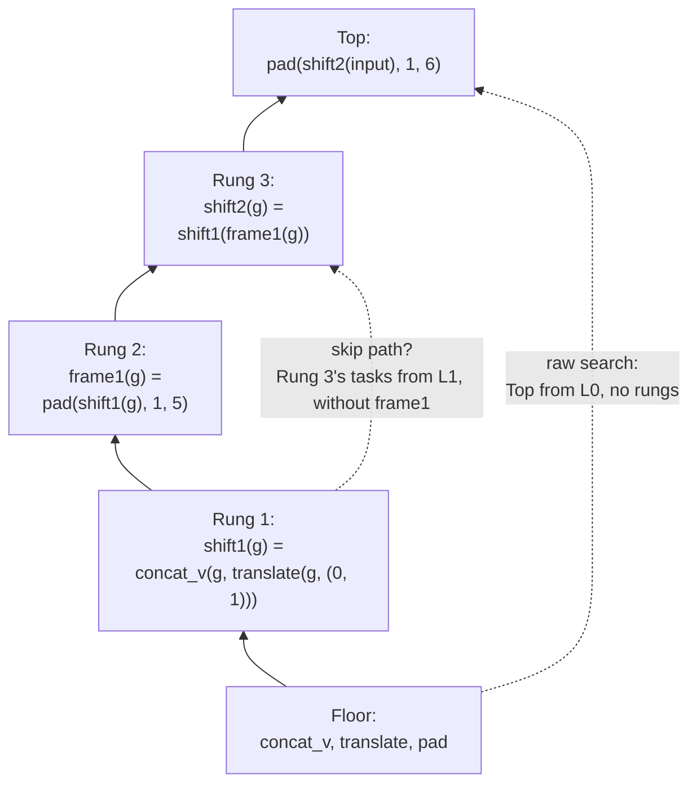

# Abstraction Ladders

An Abstraction Ladder is an authored, measurable learning trajectory: a declared primitive floor, a sequence of reusable routines built above it, demonstrations from which those routines can be learned, and a harder Top task that reuses them.

The point is not to claim that a prescribed sequence measures intelligence. It is to make a candidate path from prior knowledge to competence explicit enough to test. Once the floor, intermediate routines, budgets, and search engine are declared, a Ladder lets us ask what each step costs, what it enables, and whether the proposed intermediate routines were actually necessary.

The original [design snapshot](ABSTRACTION-LADDERS-SPEC.md), the [MVE plan](../archive/abstraction_ladders/MVE-PLAN-2026-07-25.md), and the [Ladder process](LADDER-PROCESS.md) record dated decisions and operational details.

## The Object of Study

A Ladder has four parts:

- **Floor**: the initial library of primitives, denoted $L_0$.
- **Rungs**: intermediate routines intended to be learned in sequence. After rung $r_i$, the intended library is $L_i = L_{i-1} \cup \{r_i\}$.
- **Demonstrations**: tasks whose solutions exercise a rung and give the learner evidence from which to form it.
- **Top**: a harder held-out task expected to reuse the learned rungs.



The solid edges are the Ladder; the dashed ones are questions asked about it, measured separately. A **skip path** bypasses a single rung, to test whether that rung is load-bearing. The **raw** path is the from-scratch search that the laddered cost is compared against.

The diagram is a real Ladder — [`al17-shift-frame-tall`](../../src/arc_lab/program_search/ladders/registry/al17-shift-frame-tall.ladder) — whose floor, three rungs, demonstrations, and Top are that file's declared contents, minus the example grids and each rung's held-out demonstration. It is an admitted Ladder: at its declared budget every jump was affordable and no rung had a skip path. The generated [batch of record](BATCH-OF-RECORD.md) carries the rest of the batch.

The sequence may be a chain or a DAG. A higher rung can reuse any lower rung, and its **fan-in** is the number of such calls, counted with multiplicity. The central unit is therefore a trajectory from a stated floor, not a final program in isolation.

## Why Make the Trajectory Explicit?

The same solved ARC task can represent very different achievements under different primitive libraries. A rich DSL can move much of the work into the prior; a lower floor makes the missing routines and their acquisition cost observable. Declaring the floor turns that hidden confound into an experimental parameter.

Declaring the path also creates questions that an endpoint score cannot answer:

- Which intermediate routines make a later task reachable?
- Where is the expensive residual composition?
- Does a finer decomposition reduce the deepest jump enough to justify the wider later library?
- Which costs are caused by curriculum, vocabulary, constants, or search-budget choices?

The current work uses **prescriptive** Ladders: targets, floors, and demonstration plans are authored around known programs, then the learner is evaluated without seeing the target routine. A future **descriptive** Ladder would reconstruct a trajectory actually discovered by a system. Neither a single prescriptive Ladder nor its certificate is a benchmark or a measure of general intelligence.

## Validity Before Interpretation

A Ladder must establish that its intended trajectory exists before a learner result can be interpreted.

For each rung, the machinery checks two budget-relative questions:

1. Are the rung's demonstrations reachable from the preceding library at the configured budget?
2. Can a consumer solve its task while bypassing that rung at its own budget?

A **skip path** is such a bypass. If one is found, the rung is not load-bearing under that configuration. Conversely, no detected skip says only that the rung was necessary within the stated floor, engine, and budget; it does not prove that no longer route exists.

A **rung certificate** is the resulting per-rung verdict profile. It is deliberately not a single pass/fail bit: it records affordability, skip behavior, and learnability for every rung. End-to-end validity is stricter: the Top must be reached both by the oracle chain and by the learned climb. This distinction prevents an apparently clean collection of local rungs from being mistaken for a completed learning trajectory.

## Costs and Comparisons

The primary search currency is **considered candidates**, not wall-clock time. A search that hits its candidate guard without exhausting its space is **censored**: its cost is a lower bound, not a failure or a successful result.

Two cost views matter:

- **Raw cost**: search from the floor directly to the Top.
- **Laddered cost**: the cost of acquiring intermediate routines and using them to reach the Top.

The laddered view has an idealized **marginal** form, in which each rung is solved once with only the tasks and vocabulary it needs, and an observed **end-to-end** form, which includes re-searching solved tasks, attempting tasks that are not yet reachable, and the effects of imperfect library learning. Their gap is the **loop-overhead** factor. These are instrument-relative quantities: changing the search engine, enumeration order, floor, or budget changes the measurement.

The same framework exposes non-optimal learning taxes:

| Area | Baseline | Tax example |
| --- | --- | --- |
| Curriculum | Tasks needed for a rung | Re-searching solved tasks or attempting unavailable future rungs |
| Primitives | Entries used by a rung's solution | Entries retained only for other rungs |
| Constants | Constants needed by that solution | Extra task-derived or enumerated constants |
| Budget | The minimally sufficient search setting | Larger pools, broader stop modes, or a mismatched depth/pool pairing |

These are attribution views, not automatically additive causal decompositions: changing a schedule or vocabulary can change the learned library itself.

## Relationships Between Ladders

Ladders are most informative in controlled families. The [relationship model](LADDER-RELATIONSHIPS-2026-07-23.md) names what a comparison licenses:

- **Cohort**: same floor and Top. Raw cost cancels, so differences isolate the decomposition.
- **Ablation**: same Top but a different floor. The raw-cost difference measures what the changed prior supplied.
- **Sub-ladder**: one member skips rungs of another. This tests budget-relative rung necessity.
- **Refinement**: one rung is split into several, or several are merged. This tests granularity.
- **Sibling**: same endpoints but genuinely different intermediate routines. This tests decomposition strategy.

The useful question is not whether more rungs are universally better. Smaller residual jumps can make a Top much cheaper, while each added routine also broadens subsequent search. The cost profile of a specific trajectory is the object of measurement.

## Implementation and Workflow

Each Ladder is a single declarative [`.ladder` source](LADDER-FORMAT.md), with its floor, rungs, demonstrations, Top, and configuration. The source is loaded into a structured specification, linted, probed, generated into a committed testbed, and then driven through recorded runs.

The normal workflow is:

```text
arc-lab new-ladder <name>
arc-lab lint-ladder <name>
arc-lab probe-ladder <name>
arc-lab taskgen <name>
arc-lab run-ladder <name>
```

Lint settles static questions cheaply. The probe drives the real engine to detect tractability failures, skip paths, task collisions, and mismatches between authored targets and what the learner can mint. The recorded run then supplies the oracle-chain, learned-climb, recovery, and held-out evaluation data. See the generated [check register](LINT-CHECKS.md), the generated [batch of record](BATCH-OF-RECORD.md), and the [activity model](../EXECUTION.md) for the concrete interfaces.

## Scope and Next Step

Ladders currently make authored program-learning trajectories inspectable. They do not yet constitute a benchmark in which a system discovers its own intermediate routines, nor do they by themselves test the full lifecycle of revision, merging, pruning, retirement, or distractor-task behavior.

The immediate benchmark-shaped extension keeps the declared floor and Top but removes prescribed rungs. A system must then discover a useful trajectory, while the same validity and cost instruments evaluate what it found.
